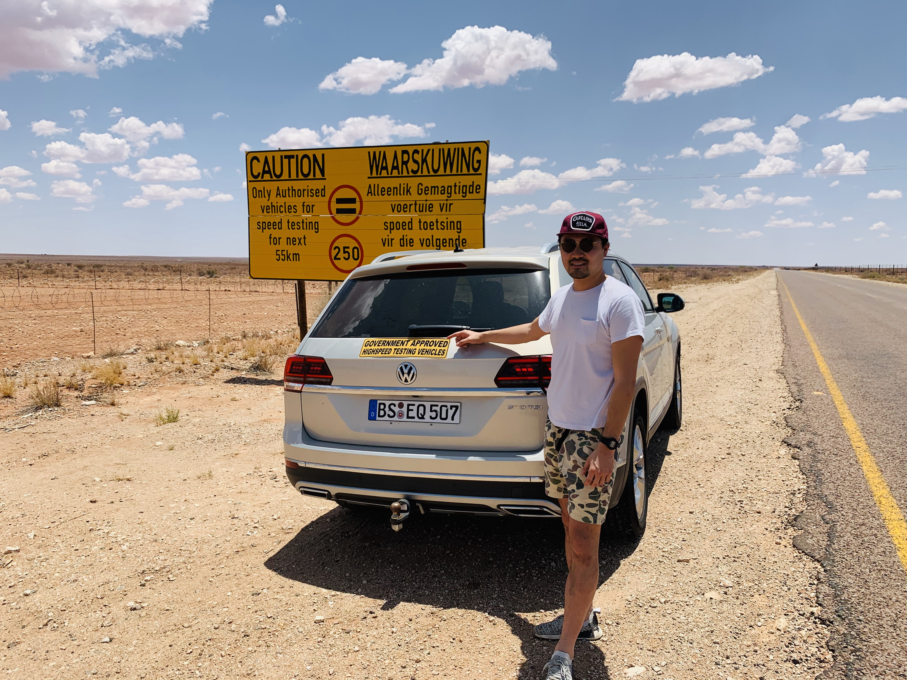

  

<h1 align="center">Hi 👋 I'm Ken</h1>

<h3 align="center">Open-minded automotive SW application engineer from Japan</h3>

  

- 💻 I’m working in **[Robert Bosch GmbH](https://www.bosch.de)** in Germany

- ✍️ I’m currently learning **data science** for data-driven world

- 👯 I’m **community manager of [CDLE](https://www.cdle.jp) (Community of Deep Learning Evangelists by [JDLA](https://www.jdla.org/en/en-about/)) in Europe**

- 🌱 I’m **project manager of AI startup to create new AI business from [CDLE](https://www.cdle.jp)**

- 🎙 I’m **branding director and host of AI for business Podcast [CDLE VOICE](https://podcasts.apple.com/jp/podcast/cdle-voice-ai%E3%82%92%E5%AD%A6%E3%81%B9%E3%82%8B%E3%83%A9%E3%82%B8%E3%82%AA/id1538017461)**

- 😄 I like **Music, Sake and Cultural Anthropology**

- 📫 How to reach me: **[Twitter](https://twitter.com/kennyatman) or email**

- 📄 Know about my experiences: **[profile_cv](https://github.com/Yamamoto-Ken/profile_cv)** (pls contact me if you wanna see)

- ⚡ Fun fact
  - **I am Yoga instructor**
  - **I am [Podcaster](https://podcasts.apple.com/jp/podcast/cdle-voice-ai%E3%82%92%E5%AD%A6%E3%81%B9%E3%82%8B%E3%83%A9%E3%82%B8%E3%82%AA/id1538017461)**
  - **I am [DJ](https://www.mixcloud.com/kennyatman/)**

<h3 align="left">Connect with me:</h3>

&nbsp;

